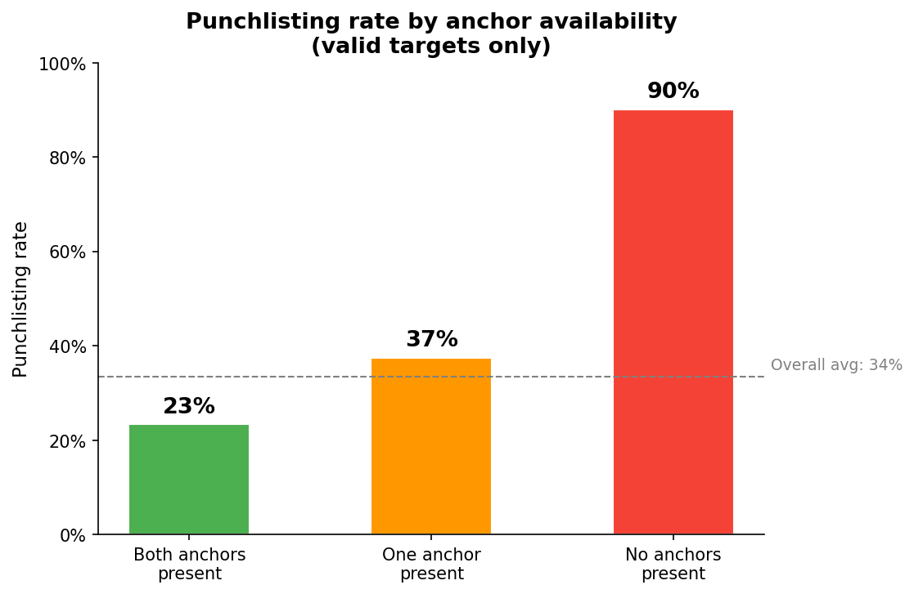

# Healthcare IT Deployment: Preventable Punchlisting Analysis

In large healthcare IT rollouts, deployment tickets routinely arrive with incomplete location and contact data. As a result, **punchlisting** — the inability to complete a deployment in a single visit — is treated as operationally normal. This project asks a narrower question: **in a system where punchlisting is expected, what portion of it is structurally preventable through minimum viable information?**

Using a structured simulation grounded in real field workflows (2,000 synthetic deployment tickets), the analysis separates **intrinsic punchlisting** (unavoidable execution constraints) from **preventable punchlisting** (failures caused by missing upstream information). The central finding: requiring just one reliable anchor — either a specific location or a human contact — reduces punchlisting dramatically, without requiring perfect data.

---



---

## Key Findings

| Condition | Punchlisting Rate |
|---|---|
| Both anchors present | ~19% |
| One anchor present | ~33% |
| **No anchors present** | **90.2%** |
| Overall (valid targets) | 33.5% |

**Logistic regression** (statsmodels, valid targets only, reference = specific location + contact present):

| Predictor | Odds Ratio | Interpretation |
|---|---|---|
| Spatial anchor missing | **6.32×** | Preventable |
| Spatial anchor vague | 2.32× | Preventable |
| Human contact absent | **3.26×** | Preventable |
| Execution constraint | 4.78× | Intrinsic — unavoidable |

**Counterfactual:** Enforcing a Minimum Anchor Rule (≥1 anchor required) would avoid an estimated **~87 revisits per 2,000 valid deployments — a 13% reduction** — without requiring perfect upstream data.

---

## The Core Distinction

| Type | Cause | Fixable via better ticketing? |
|---|---|---|
| **Intrinsic** | Workstation in use, locked room, patient present | No |
| **Preventable** | Missing location, no contact, ambiguous dept label | Yes |

This distinction is encoded structurally in the simulation. `execution_constraint` affects punchlisting probability regardless of anchor quality (intrinsic noise). Anchor and ambiguity variables layer on top of that baseline (preventable signal). The goal is not to eliminate punchlisting — it's to identify the portion that better ticketing can actually fix.

> There exists a minimum viable information threshold below which human judgment fails to scale.

---

## Recommendation

**Minimum Anchor Rule** — Require deployment tickets to include at least one of:
- A specific physical location
- A designated human point of contact

Perfect information is unnecessary. But when both anchors are missing, failure becomes structurally likely. This is a low-cost upstream intervention that reduces downstream rework without redesigning the entire workflow.

Supporting recommendations:
- Replace free-text department descriptions with structured location fields
- When no anchor exists, begin by coordinating with a department manager before attempting deployment

---

## Operational Context

This analysis models a real healthcare IT deployment workflow:
- Ticketing system modeled after FileMaker, with ~40% upstream data accuracy
- Field technicians deploying peripherals (tap badges, signature pads) across large hospital departments
- Leadership explicitly acknowledged low data quality; punchlisting was treated as operationally normal

The simulation is grounded in observed failure patterns, not randomized. Key co-occurrences are preserved: missing inventory records tend to co-occur with missing contact and location data, and ambiguous department labels correlate with degraded spatial specificity.

---

## Data Design

2,000 synthetic deployment tickets. Each row represents one ticket.

| Variable | Values | Notes |
|---|---|---|
| `task_applicability` | valid_target / invalid_target | Invalid targets excluded from primary analysis |
| `spatial_anchor` | specific / vague / missing | Core predictor |
| `human_anchor` | present / absent | Core predictor |
| `dept_label_quality` | unambiguous / ambiguous | Degrades spatial specificity slightly |
| `execution_constraint` | 0 / 1 | Intrinsic blocker — ~12% of tickets |
| `punchlisted` | 0 / 1 | Primary outcome |
| `revisit_required` | 0 / 1 | Probabilistic — 80% of punchlisted tickets |
| `revisit_successful` | yes / no / resolved_admin | 20% resolved administratively, no revisit |

---

## Methodology

**Descriptive analysis** — punchlisting rates by anchor availability, department label quality, and task applicability.

**Logistic regression** — fit on valid targets only using `spatial_anchor`, `human_anchor`, `dept_label_quality`, and `execution_constraint`. Statsmodels used for odds ratios and 95% confidence intervals. This is an explanatory model, not a predictive optimization exercise. Pseudo R² of 0.14 is appropriate for noisy operational data where intrinsic variability is expected.

**Counterfactual simulation** — if all valid tickets satisfied the Minimum Anchor Rule, non-compliant tickets are assumed to perform at the current compliant-ticket rate. This assumption does not eliminate intrinsic constraints, does not assume perfect data, and does not assume behavioral changes. It is a conservative lower bound.

---

## How to Reproduce

```bash
pip install -r requirements.txt
python src/generate_data.py   # generates data/raw/tickets.csv
python src/analyze.py         # outputs figures, tables, summary.json
```

---

## Project Structure

```
deployment-punchlisting-analysis/
├── src/
│   ├── config.py           # all parameters and base rates
│   ├── generate_data.py    # simulation with labeled intrinsic/preventable score components
│   ├── analyze.py          # rates, figures, logistic regression, counterfactual
│   └── utils.py            # shared helpers
├── data/raw/tickets.csv
├── outputs/
│   ├── figures/
│   ├── tables/
│   └── summary.json
├── requirements.txt
└── README.md
```

---

## Limitations

- Simulated data cannot capture full behavioral variability — unresponsive contacts appear as "human anchor present" but still cause punchlisting
- Findings are directional and explanatory, not predictive
- Counterfactual assumes anchor compliance is enforceable upstream
- No temporal or technician-level variation modeled


